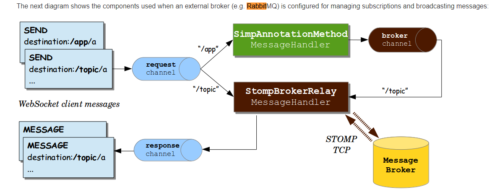

# TMDAD_2024
Backend del chat distribuido para la asignatura "Tecnologías y modelos para el desarrollo de aplicaciones distribuidas"

Máster Universitario en Ingeniería Informatica de la Universidad de Zaragoza

Curso 2023-2024

## Instalación

Clona el repositorio:

```
git clone https://github.com/gcruz-UZ/TMDAD_2024.git
```

Y abre el proyecto con IntelliJ. Cuando haya terminado de descargar las dependencias, puedes ejecutar la aplicación.

## Sentencias SQL para ElephantSQL

Crear tabla de usuarios:

```
CREATE TABLE chat_user (
id INT GENERATED BY DEFAULT AS IDENTITY PRIMARY KEY,
login VARCHAR(50) UNIQUE,
name VARCHAR(100),
is_superuser BOOLEAN
);
```

Insertar usuario:

```
INSERT INTO chat_user VALUES
    (1, 'gcruz', 'Guillermo Cruz', TRUE);
```

Crear tabla de grupos:

```
CREATE TABLE room (
id INT GENERATED BY DEFAULT AS IDENTITY PRIMARY KEY,
name VARCHAR(100)
);
```

Insertar grupo:

```
INSERT INTO room VALUES
    (1, 'FIRST ROOM');
```

Crear tabla usuario-grupo:

```
CREATE TABLE user_room (
user_id INT,
room_id INT,
PRIMARY KEY(user_id, room_id),
FOREIGN KEY(user_id) REFERENCES chat_user(id),
FOREIGN KEY(room_id) REFERENCES room(id)
);
```

Insertar relaciones usuario-grupo:

```
INSERT INTO user_room VALUES
    (1, 1);
```

## Notas clase

Documentacion para conectar nuestra aplicacion con el broker RabbitMQ: investigar en este enlace

```
https://docs.spring.io/spring-framework/docs/4.3.x/spring-framework-reference/html/websocket.html
```

La imagen es:


